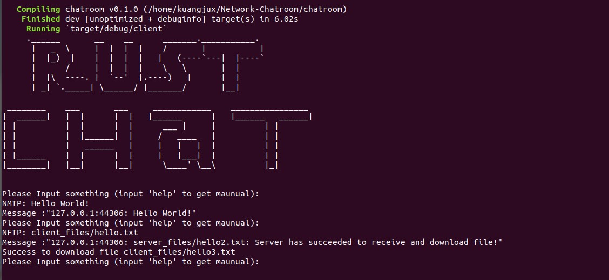

# Rust Chat

```
     .______       __    __      _______.___________.  
      |   _  \     |  |  |  |    /       |           |  
      |  |_)  |    |  |  |  |   |   (----`---|  |----`
      |      /     |  |  |  |    \   \       |  |
      |  |\  ----. |  `--'  |.----)   |      |  |
      | _| `._____| \______/ |_______/       |__|           

 ________    ___       ___     ____________    ________________
|  ______|   |  |      |  |   |______      |   |______   ______|
| |          |  |      |  |      ___ |     |          | |
| |          |  |______|  |     /   ____   |          | |
| |          |   ______   |     |   |   |  |          | |
| |______    |  |      |  |     |   |___|  |          | |
|________|   |__|      |__|      \____' \__\          |_|


```

## Introduction

天津大学2021春季计网作业

使用Rust实现网络聊天室；设计了三种协议，支持消息传输，文件传输以及在Linux下的语音传输，对高并发、粘包、客户端异常等情况进行处理。

## Finished

- [x] 消息传输
- [x] 文件传输
- [x] Linux语音通信
- [x] 粘包处理
- [x] 异常处理
- [x] 延迟处理
- [x] 高并发处理
- [x] Docker支持

## TODO List

- [ ] 好看的GUI
- [ ] 异步IO代替多线程
- [ ] 即时通信

## Demo



## Usage

```
git clone https://github.com/KuangjuX/Rust-Chat.git
cd Rust-Chat/chatroom
```

运行服务端：`cargo run --bin server`

运行客户端：`cargo run --bin client`

