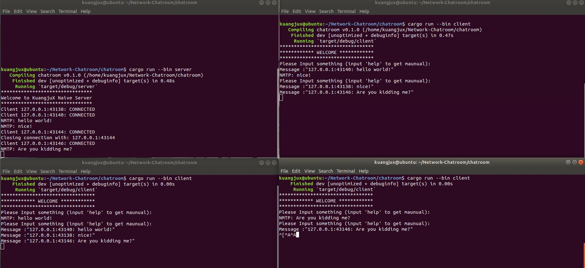

# Network ChatRoom

## Introduction

天津大学2021春季计网作业

使用Rust实现网络聊天室；设计了三种协议，支持消息传输，文件传输以及在Linux下的语音传输，对高并发、粘包、客户端异常等情况进行处理。

## Finished

- [x] 消息传输
- [x] 文件传输
- [x] Linux语音通信
- [x] 粘包处理
- [x] 异常处理
- [x] 延迟处理
- [x] 高并发处理

## TODO List

- [ ] 好看的GUI
- [ ] 异步IO代替多线程
- [ ] 即时通信

## Demo

